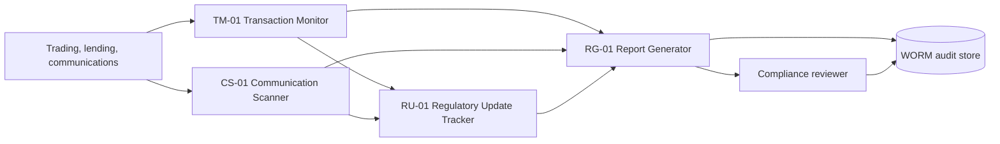

# System topology

Version: 1.0 | Rule set: 2026.08.1

The local reference implementation executes a deterministic pipeline in `agents.run_case`. Production deployment should place each agent behind an authenticated queue and persist every envelope and decision to append-only WORM storage.
