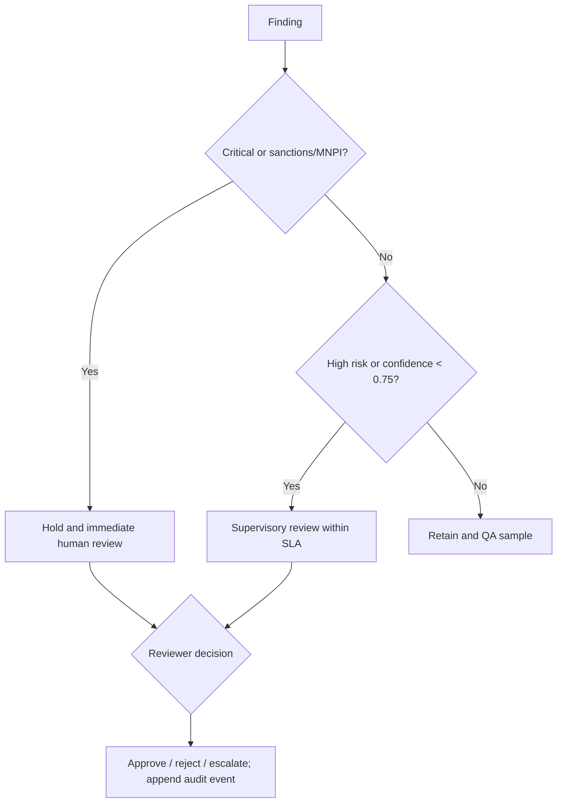

# Decision trees

```mermaid
flowchart TD
 A[Finding] --> B{Critical or sanctions/MNPI?}
 B -- Yes --> C[Hold and immediate human review]
 B -- No --> D{High risk or confidence < 0.75?}
 D -- Yes --> E[Supervisory review within SLA]
 D -- No --> F[Retain and QA sample]
 C --> G{Reviewer decision}
 E --> G
 G --> H[Approve / reject / escalate; append audit event]
```
